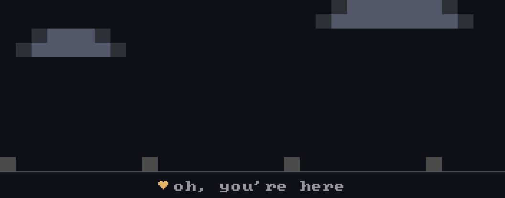

i make things. some useful, some just because they looked fun.

---

## Inventory

---

## Quest Log

Stuff I built when the mood hit — details live in each repo.

- **[Cognitus AI](https://github.com/aldeniaalexandra/data-analysis-chatbot)** — a chatbot that reads your CSV and talks back
- **[RAG Resume Screener](https://github.com/aldeniaalexandra/rag-resume-screener)** — retrieval-augmented résumé ranking
- **[Tomato Leaf Disease Detection](https://github.com/aldeniaalexandra/tomato-leaf-disease)** — snap a leaf, get a diagnosis
- **[Telco Customer Churn](https://github.com/aldeniaalexandra/customer-churn-prediction)** — who's leaving, and why

---

## Trophy Cabinet

<b>a few things from a past life poking at rocks and physics with ML</b>

 

| Year | Type | Title | Where |
|:--:|:--|:--|:--|
| 2024 | paper | [Machine Learning for Physical Parameters of 3D Fractures](https://doi.org/10.3390/app142412037) | Applied Sciences · Q1 (MDPI) |
| 2024 | paper | [2D Physical Parameters of Digital Rocks via Deep Learning](https://doi.org/10.1088/1402-4896/ad9d08) | Physica Scripta · Q1 (IOP) |
| 2024 | paper | [Lattice Boltzmann + Image Processing for Digital Rock](https://doi.org/10.3390/app14177509) | Applied Sciences · Q1 (MDPI) |
| 2023 | paper | [ML for 2D Fracture Properties Estimation](https://doi.org/10.25299/jgeet.2023.8.02-2.13874) | JGEET · Sinta 2 |
| 2024 | patent | RophysiX | EC00202479885 |
| 2024 | patent | Petra | EC00202462911 |
| 2024 | patent | SiFrac-ML | EC00202462898 |
| 2022 | patent | NeoFract | EC002022116119 |

---

## Party Up

 

