<div align="center">



</div>

<div align="center">

`> a lifelong learner`&nbsp;&nbsp;`> i build to learn`&nbsp;&nbsp;`> forever leveling up`

</div>

---

## 🎮 PLAYER 1

```
NAME     : Aldenia Alexandra
CLASS    : Curious Human (multiclass, no fixed build)
QUEST    : turn scattered data + wild ideas into things that actually work
STATUS   : online, exploring, occasionally debugging at 2AM
```

I don't like boxing myself into one label. I just really like *figuring things out* —
poking at data, training a model to see what happens, shipping something small,
breaking it, and learning why. This page is my save file.

```text
CURIOSITY    ██████████  MAX
PERSISTENCE  █████████░  it compiles eventually
CAFFEINE     ████████░░  refill in progress
BUG-SLAYING  ███████░░░  still farming XP
SLEEP        ████░░░░░░  known issue, wontfix
```

---

## 🎒 INVENTORY

*Tools I've picked up along the way — still collecting.*


> 🧪 *Currently grinding a new skill tree: cloud computing.*

---

## 🗺️ QUEST LOG

*Side quests I've taken on because they seemed fun.*

| | Quest | What it's about |
|:--:|:--|:--|
| 🤖 | **[Cognitus AI](https://github.com/aldeniaalexandra/data-analysis-chatbot)** | A chatbot you can just *talk* to about your CSV — it writes the Python, runs the analysis, and hands back charts + insights. |
| 📄 | **[RAG Resume Screener](https://github.com/aldeniaalexandra/rag-resume-screener)** | Uses Retrieval-Augmented Generation to read résumés and rank candidates against a job description. |
| 🍅 | **[Tomato Leaf Disease Detection](https://github.com/aldeniaalexandra/tomato-leaf-disease)** | Snap a photo of a leaf, get a diagnosis — a small EfficientNetB0 web app for plant diseases. |
| 📉 | **[Telco Customer Churn](https://github.com/aldeniaalexandra/customer-churn-prediction)** | Predicts who's about to leave and *why*, so the "why" is actually useful. |

---

## 🏆 TROPHY CABINET

*A few achievements that unlocked along the way — mostly from a past life poking at rocks, fractures, and physics with ML.*

<details>
<summary><b>▶ open the trophy cabinet</b></summary>

<br/>

| Year | 🎖️ | Title | Where |
|:--:|:--|:--|:--|
| 2024 | 📜 | [Machine Learning for Physical Parameters of 3D Fractures](https://doi.org/10.3390/app142412037) | Applied Sciences · Q1 (MDPI) |
| 2024 | 📜 | [2D Physical Parameters of Digital Rocks via Deep Learning](https://doi.org/10.1088/1402-4896/ad9d08) | Physica Scripta · Q1 (IOP) |
| 2024 | 📜 | [Lattice Boltzmann + Image Processing for Digital Rock](https://doi.org/10.3390/app14177509) | Applied Sciences · Q1 (MDPI) |
| 2023 | 📜 | [ML for 2D Fracture Properties Estimation](https://doi.org/10.25299/jgeet.2023.8.02-2.13874) | JGEET · Sinta 2 |
| 2024 | 🧾 | **RophysiX** | Patent · EC00202479885 |
| 2024 | 🧾 | **Petra** | Patent · EC00202462911 |
| 2024 | 🧾 | **SiFrac-ML** | Patent · EC00202462898 |
| 2022 | 🧾 | **NeoFract** | Patent · EC002022116119 |

</details>

---

## 🕹️ PARTY UP

*Wanna team up, or just say hi? Pick a portal.*

[](https://www.linkedin.com/in/aldeniaalexandra)
[](https://github.com/aldeniaalexandra)
[](mailto:aldnalexandr@gmail.com)

---

<div align="center">

<sub>

`CONTINUE?` &nbsp; ▓▒░ thanks for stopping by my save file ░▒▓

</sub>

<br/>


</div>
